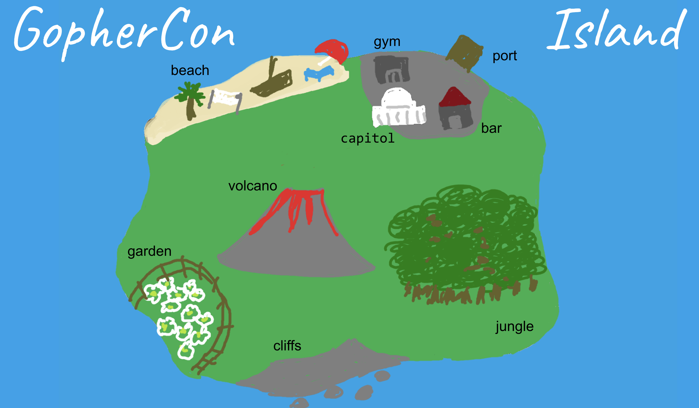
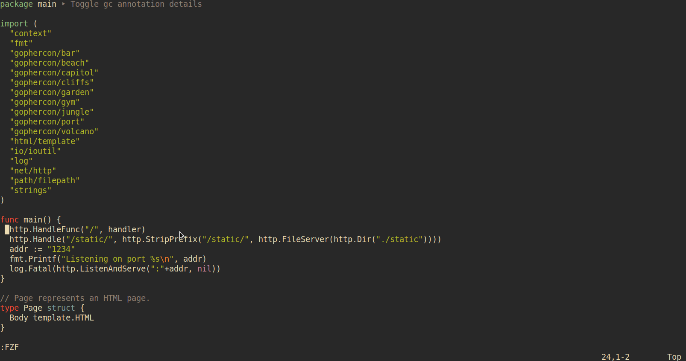

# A Debugger Treasure Hunt

This project is designed to help you get familiar with different debugging features while you go on an adventure with the Go gopher to find a lost treasure!

Download this repository and open it with VS Code to follow along.

```
$ git clone https://github.com/suzmue/gophercon.git
$ code gophercon
```


## Treasure hunting in other editors

Because delve speaks the Debug Adapter Protocol, you can go treasure hunting in many other editors, too!

For example, to get started debugging in Vim:

1. Install the [vimspector](https://github.com/puremourning/vimspector) plugin.
2. Open `main.go` and `:call vimspector#Launch()`. This will run the `run-dap`
   launch configuration in `.vimspector.json`. See the [vimspector
   documentation](https://github.com/puremourning/vimspector#readme) for more
   information on debugging in vim, including setting up key bindings.

Spoilers below!

<details>



</details>
